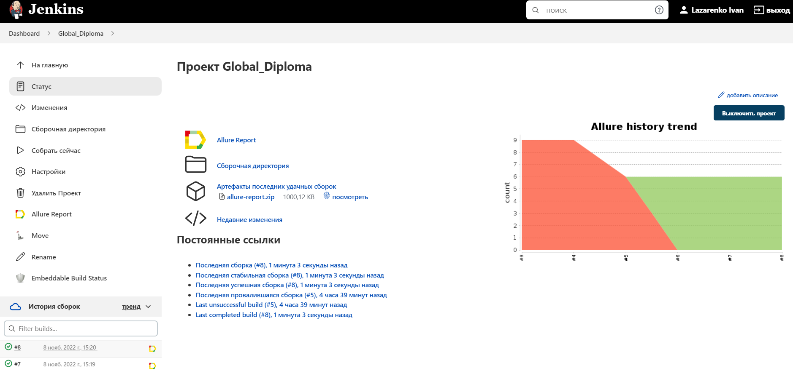
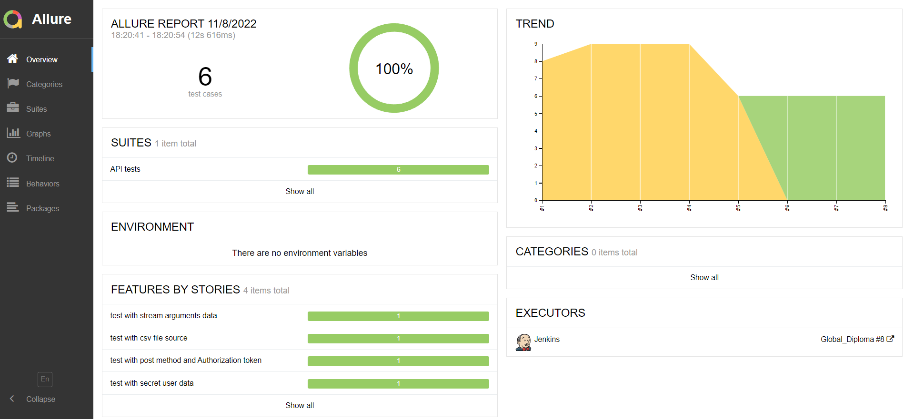
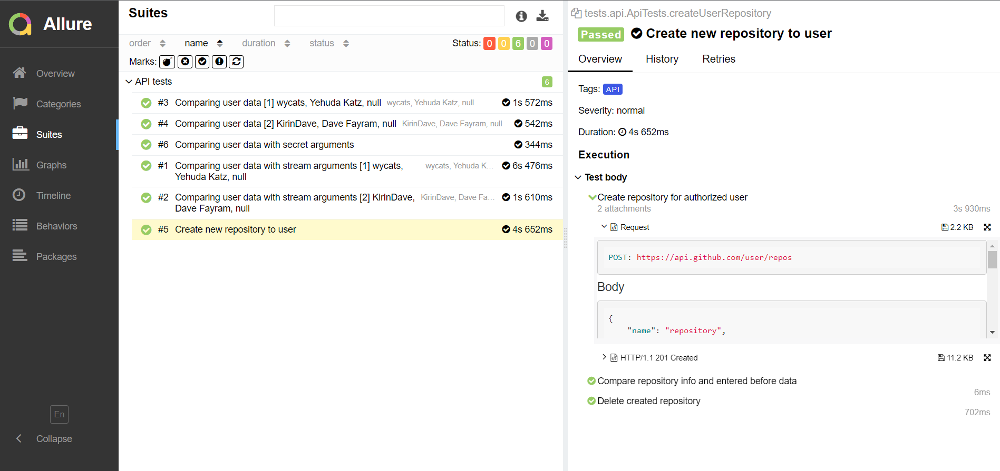
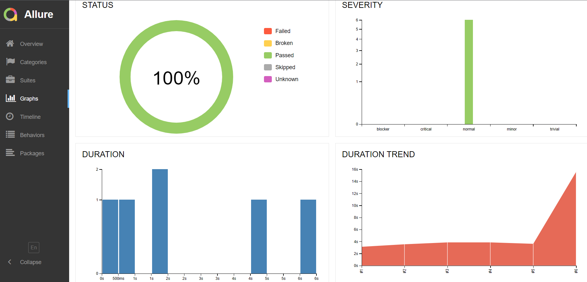
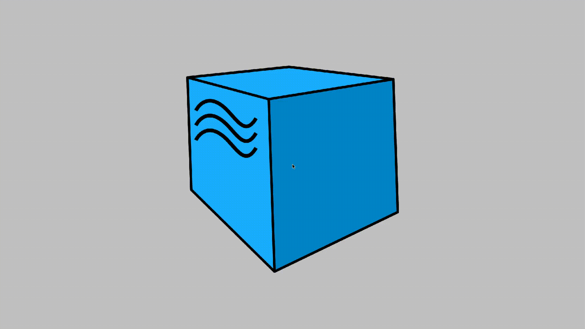
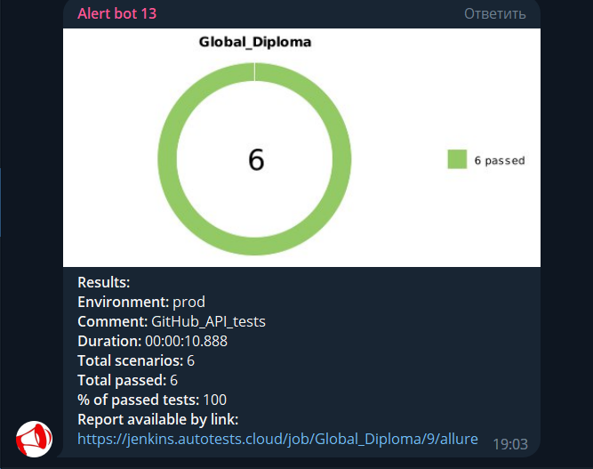

# GitHub. Автотесты на Java

<a name="наверх"></a>

## Содержание :bookmark_tabs:
* <a href="#stack">Cтек технологий</a>
* <a href="#objects">Объекты тестирования</a>
* <a href="#SystemProperty">Команды для запуска из терминала</a>
* <a href="#Jenkins">Запуск тестов в Jenkins</a>
* <a href="#AllureReport">Отчет о результатах тестирования в Allure</a>
* <a href="#selenoid">Видео прогона UI автотестов с удаленного сервера</a>
* <a href="#Telegram">Уведомление в Telegram при помощи Alert bot</a>


<a id="stack"></a>
## Cтек технологий :hammer_and_wrench:

<div align="center">
<a href="https://www.jetbrains.com/idea/"></a>
<a href="https://www.java.com/"></a>
<a href="https://junit.org/junit5/"></a>
<a href="https://selenide.org/"></a>
<a href="https://rest-assured.io/"></a>
<a href="https://aerokube.com/selenoid/"></a>
<a href="https://gradle.org/"></a>
<a href="https://www.jenkins.io/"></a>
<a href="https://qameta.io/"></a>
<a href="https://github.com/allure-framework/"></a>
<a href="https://github.com/"></a>
</div>


<a id="objects"></a>
## Объекты тестирования :mag:

Разработаны автотесты для проверок:

### --== API. Тесты по api.github.com ==--

:white_check_mark: создание нового репозитория пользователя (тест с использованием авторизационного токена)

:white_check_mark: удаление нового репозитория пользователя ( тест с использованием авторизационного токена)

:white_check_mark: корректность данных профиля пользователя. Параметризованный (данные из csv файла)

:white_check_mark: корректность данных профиля пользователя. Параметризованный (данные из из Stream'a)

:white_check_mark: корректность данных профиля пользователя. Параметризованный (данные из секретного файла)

### --== UI. Тесты по github.com ==--

:white_check_mark: редактирование профиля пользователя

:white_check_mark: проверка даты регистрации пользователя на сайте


<a id="SystemProperty"></a>
<h1 align="left">
  <a name="Jenkins"><i>Запуск тестов из консоли</i></a>
</h1>

```bash
gradle clean 
-DtestType=${TEST_TYPE}
-Dbrowser=${BROWSER}
-DbrowserSize=${BROWSER_SIZE}
-Dhost=${HOST}

```
> `${TEST_TYPE}` - вид теста [ *test* <sub>(default)</sub> , *api_tests*, *combo_tests*, *ui_tests* ]
>
>
> `${BROWSER}` - браузер [ *chrome* <sub>(default)</sub> , *firefox*, *opera*]
>
> `${BROWSER_SIZE}` - размер окна браузера  [ *1920x1080* <sub>(default)</sub> , *1366x768*, *1280x1024*]
>
> `${HOST}` - хост прогона тестов [ *remote* <sub>(default)</sub> , *local* ]


<a id="Jenkins"></a>
<h1 align="left">
  <a name="Jenkins"><i>Запуск тестов в Jenkins</i></a>
</h1>

<a target="_blank" href="https://jenkins.autotests.cloud/job/Global_Diploma/">**Сборка в Jenkins**</a>
<p align="center">  
<a href="https://jenkins.autotests.cloud/job/qa_guru_diplom_API_tests"></a>  
</p>

<h1 align="left">
  <a name="AllureReport"><i>Отчет о результатах тестирования в Allure </i></a>
</h1>

<a target="_blank" href="https://jenkins.autotests.cloud/job/Global_Diploma/8/allure/">**Allure отчёт из Jenkins**</a>
<p align="center">  


### *Основная страница отчёта*

<p align="center">  
  
</p>  

### *Тест кейсы*

<p align="center">  
  
</p>

### *Графики*

  <p align="center">  
  
</p>

<a id="selenoid"></a>
### Selenoid</a>

### *Пример видео выполнения теста на Selenoid*

<p align="center"> 
   
</p>

<a id="Telegram"></a>
<h1 align="left">
 <a name="Telegram"><i>Уведомление в Telegram при помощи Alert bot</i></a>
</h1>

<p align="center">  
  
</p>

[Наверх ⬆](#наверх)


